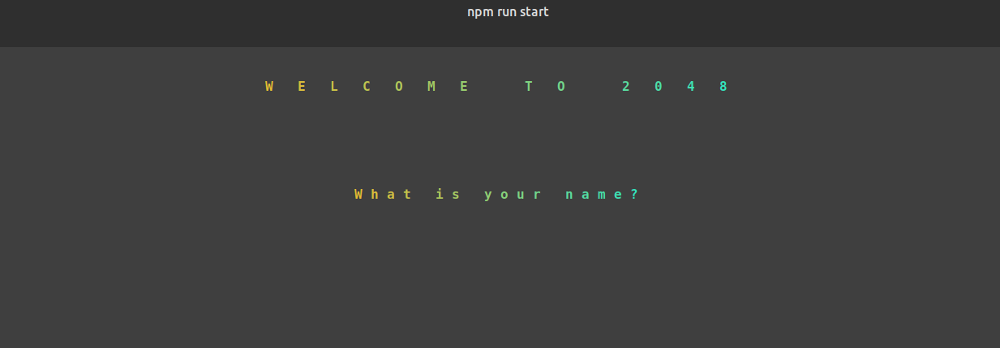
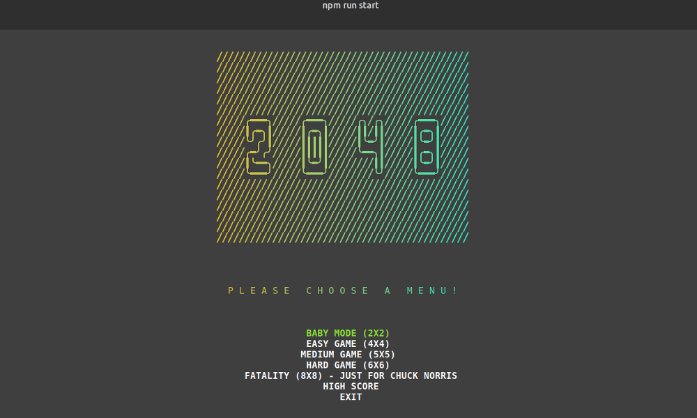
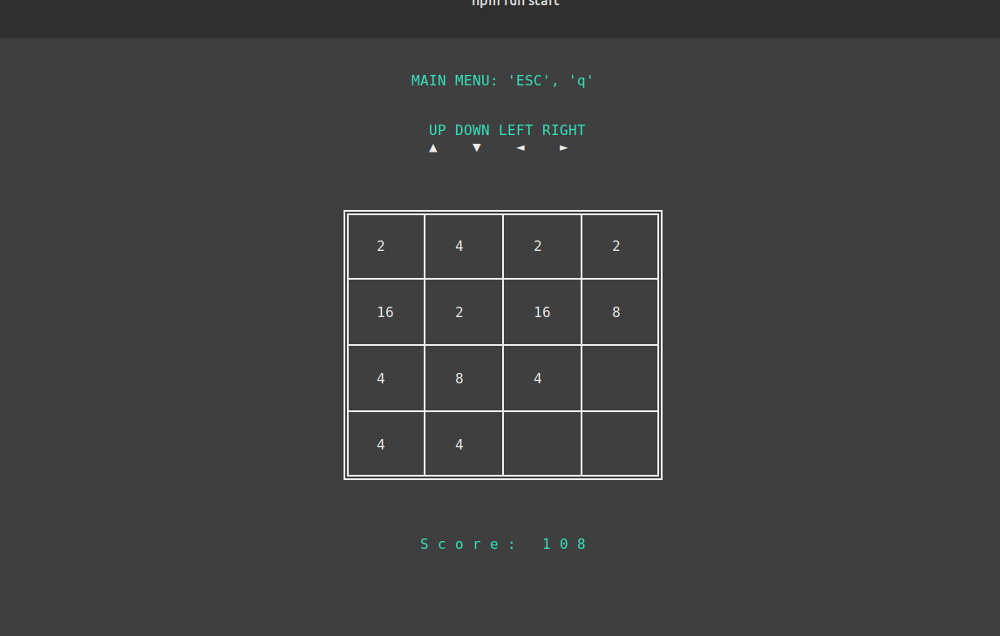
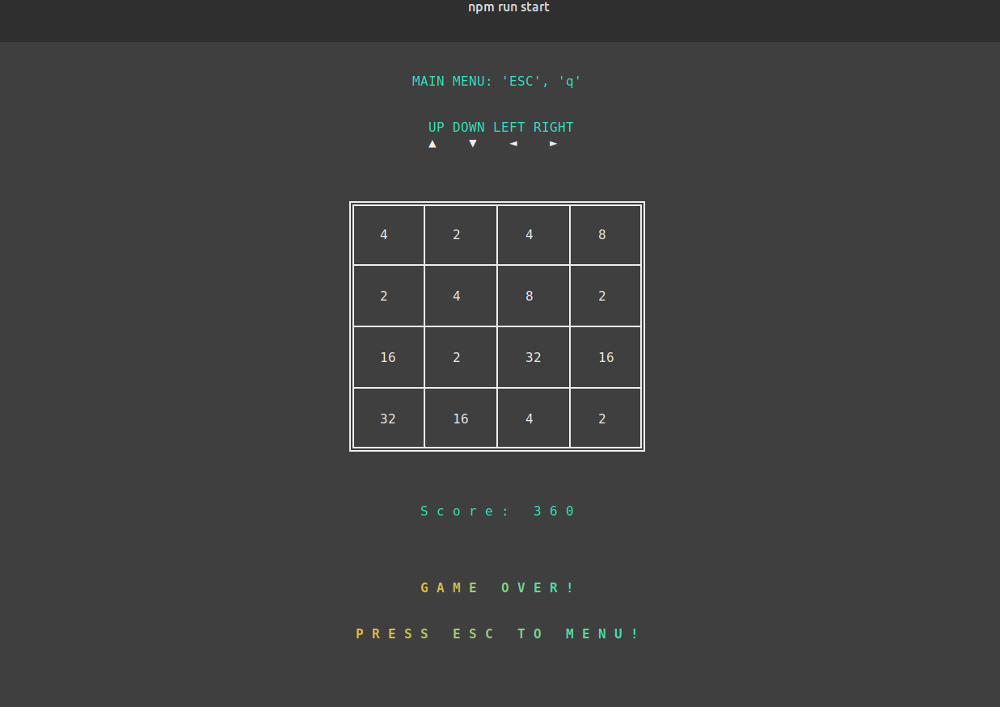
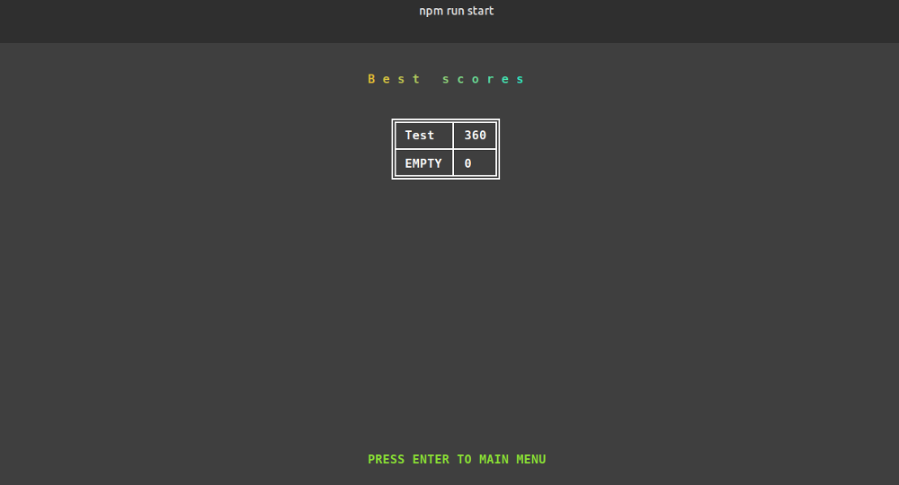

# 2048 game

### Installation

`git clone git@github.com:Redturtle42/2048-game.git`

`cd 2048-game/`

`npm install`

### Run

`npm run start` or `node index.js`

### Used packages

- center-align
- cfonts
- readline-sync
- table
- terminal-kit

### Features

* Save the current user name for the top 10 highscore

* Enable to use mouse in main menu

* Five different size gameboard

* Clean appearance

### Development environment:

* Operation system: Ubuntu 18.04.1 LTS

### Some screenshots

### About

This is my first presentation what I made for my IT school exam.

In spare time I would like to continue this project, so in the nearest future please come and visit my site to check the newest improvements.

Hope you enjoy it! :)

